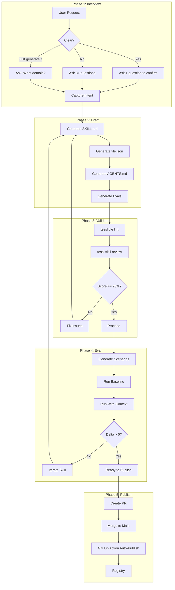
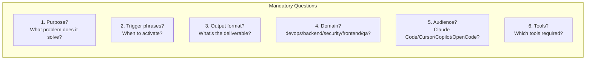
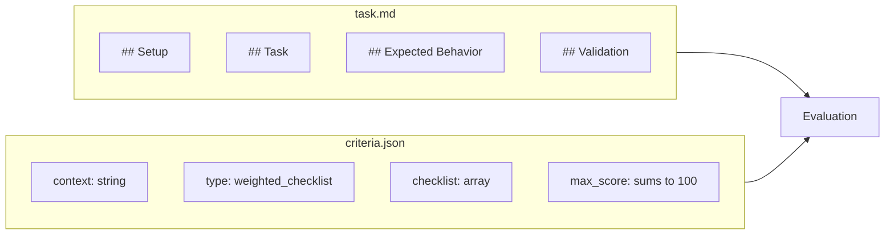
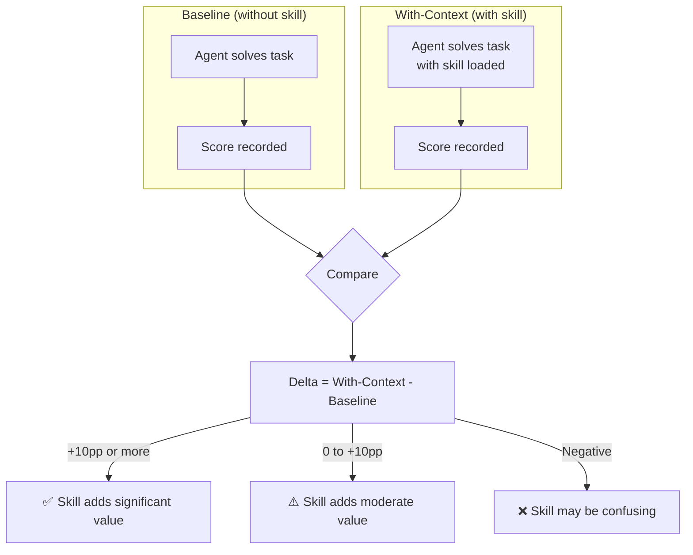
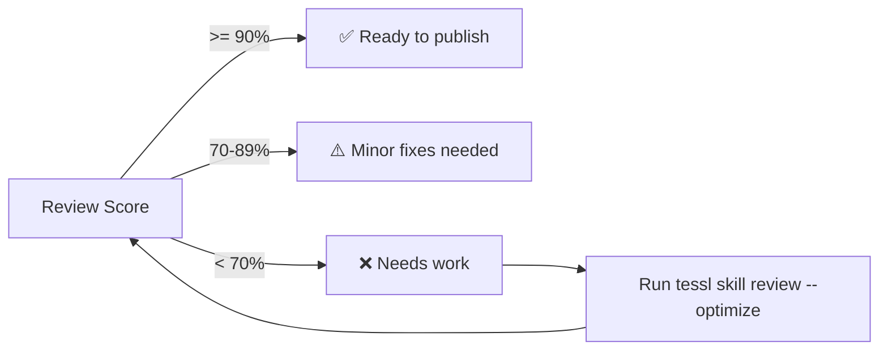
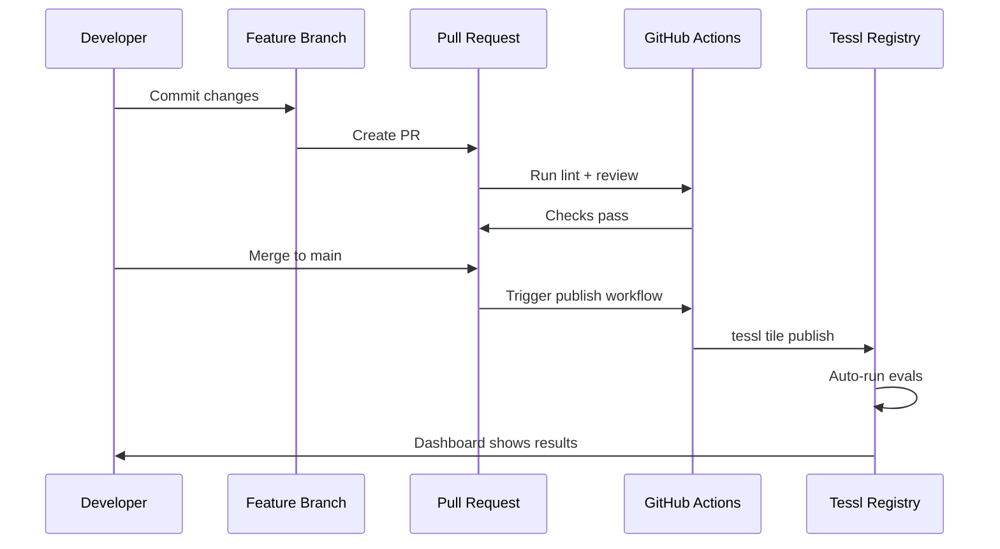
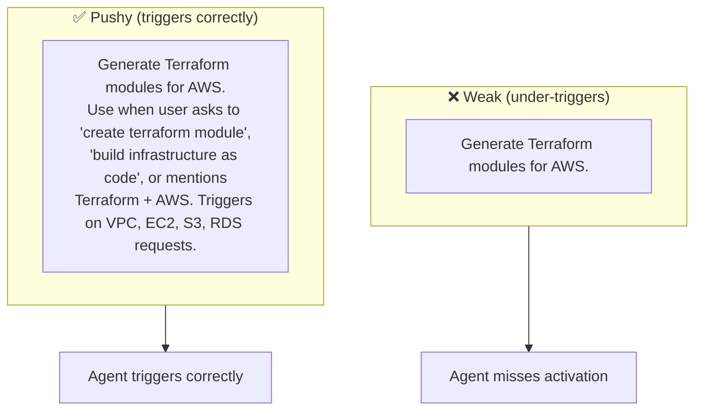

# tessl-skill-builder

> Generate production-ready Tessl skills from prompts with full spec compliance.

[](https://tessl.io/registry/steio-skills/tessl-skill-builder)
[](https://tessl.io/registry/steio-skills/tessl-skill-builder)
[](https://tessl.io/registry/steio-skills/tessl-skill-builder/quality)

## Overview

Meta-skill that generates production-ready Tessl skills from prompts. Combines **anthropic-skill-creator** methodology with **Tessl-specific** templates for complete workflow: interview → draft → eval → publish.

## Install

```bash
tessl install steio-skills/tessl-skill-builder
```

## Trigger Phrases

Activate when user says:
- "create a skill"
- "build a skill"
- "generate a tessl skill"
- "scaffold a new skill"
- "I want a skill for [domain]"

## Complete Workflow



## Interview Phase (CRITICAL)

**Before generating ANY tile, the agent MUST ask clarifying questions.**



| Request Type | Action |
|--------------|--------|
| Clear, specific | Ask 1 question to confirm |
| Ambiguous, vague | Ask 3+ questions until clear |
| "Just generate it" | Ask: "What domain should this be in?" |

> ⚠️ Skipping this phase is the #1 cause of skill failures.

## Generated Output Structure

```
tiles/<domain>/<name>/
├── tile.json           # Tile manifest (REQUIRED)
├── AGENTS.md           # Project context (REQUIRED)
├── skills/
│   └── <name>/
│       └── SKILL.md    # Skill instructions (REQUIRED)
├── docs/               # Additional documentation (OPTIONAL)
└── evals/              # Eval scenarios (REQUIRED: 2-3)
    └── <scenario>/
        ├── task.md
        └── criteria.json
```

## File Templates

### SKILL.md

```yaml
---
name: <skill-name>        # kebab-case
description: <1-1024 chars, "pushy" style>
---

## When to Use
<trigger phrases and contexts>

## Core Process
<numbered workflow>

## Reference
<examples, patterns, anti-patterns>
```

### tile.json

```json
{
  "name": "steio-skills/<name>",
  "version": "0.1.0",
  "summary": "<brief description>",
  "entrypoint": "AGENTS.md",
  "private": true,
  "skills": { "<name>": { "path": "skills/<name>/SKILL.md" } }
}
```

### AGENTS.md

```markdown
# <Project Name>

Brief description.

## Project Structure
\`\`\`
<project>/
├── src/
├── tests/
└── docs/
\`\`\`

## Key Commands
| Command | Purpose |
|---------|---------|
| `npm test` | Run tests |

## Architecture Decisions
- Decision 1: Why we made this choice
```

### Eval Structure



**Category types for criteria.json:**
- `INTENT` — Does it understand the goal?
- `DESIGN` — Is the architecture sound?
- `MUST_NOT` — Does it avoid anti-patterns?
- `MINIMALITY` — Is it minimal/no over-engineering?
- `REUSE` — Does it leverage existing code?
- `INTEGRATION` — Does it fit the codebase?
- `EDGE_CASE` — Does it handle edge cases?

## Evaluation Workflow



### Commands

```bash
# Generate scenarios
tessl scenario generate <tile> --count=3 --workspace=<ws>

# Download and integrate
tessl scenario download --last && mv ./evals/ <tile>/evals/

# Run evaluation
tessl eval run <tile> --workspace=<ws>

# Validate structure
tessl tile lint ./<tile>

# Quality review
tessl skill review ./<tile>
```

## Score Thresholds



## Publishing Flow



> **Note:** Evals only appear in dashboard after publish to registry.

## Description Optimization

The `description` field in SKILL.md frontmatter is the **primary triggering mechanism**.



### Optimization Process

1. Create `evals/description-queries.json`:
```json
{
  "should_trigger": ["create a terraform module for S3", "I need infrastructure as code"],
  "should_not_trigger": ["create a Python script", "help me write a React component"]
}
```

2. Run trigger eval
3. Select description with >90% trigger rate, <10% false positives

## Validation Checklist

### SKILL.md
- [ ] Frontmatter parses as valid YAML
- [ ] `name` is kebab-case
- [ ] `description` ≤ 1024 chars
- [ ] No placeholder text (`<TBD>`, `<TODO>`)

### tile.json
- [ ] Valid JSON
- [ ] `name` starts with `steio-skills/`
- [ ] `version` is `0.1.0` for new tiles (never `0.0.1` or `1.0.0`)
- [ ] `private: true` until production-ready

### Evals
- [ ] task.md has: Setup, Task, Expected Behavior, Validation
- [ ] criteria.json has: `context`, `type: "weighted_checklist"`, checklist with `category`
- [ ] max_score sums to 100
- [ ] Multiple category types used

## Quality Metrics

| Metric | Score |
|--------|-------|
| Skill Review | 93% |
| Description | 100% |
| Content | 85% |
| Eval Scenarios | 10 |
| Eval (with context) | 85% |
| Eval (baseline) | 71% |
| Impact | +14pp delta |

## Dependencies

| Dependency | Source | Purpose |
|------------|--------|---------|
| `steio-skills/anthropic-skill-creator` | Local fork | Interview methodology, iteration workflow |

The `anthropic-skill-creator` is a local fork with weekly auto-sync from upstream.

## Documentation

| Document | Description |
|----------|-------------|
| [SKILL.md](skills/tessl-skill-builder/SKILL.md) | Main skill file |
| [docs/](docs/) | Tessl documentation |
| [docs/companion-skills.md](docs/companion-skills.md) | Related skills |
| [docs/configuration.md](docs/configuration.md) | tile.json reference |
| [docs/eval-criteria.md](docs/eval-criteria.md) | Eval categories |

## Companion Skills

| Skill | Purpose |
|-------|---------|
| `eval-setup` | Generate and run eval scenarios |
| `eval-improve` | Improve eval scores |
| `compare-skill-model-performance` | Multi-model comparison |
| `developing-tessl-skills` | Full lifecycle workflow |
| `tile-creator` | Alternative tile creation |

## Error Handling

| Scenario | Response |
|----------|----------|
| Ambiguous request | Ask clarifying questions |
| Missing domain | Default to `devops`, confirm |
| File exists | Warn, offer overwrite |
| Review < 70% | Suggest `tessl skill review --optimize` |
| Baseline ≈ With-context | Warn: skill adds little value |

## Security

This skill has been reviewed for security:
- ✅ No external repository dependencies (uses local fork)
- ✅ No arbitrary URL fetching
- ✅ Eval scenarios run in isolated environment

## License

Private tile for steio-skills workspace.

---

Maintained by [steio](https://github.com/steio).